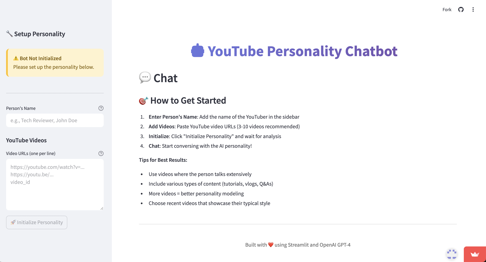

# YouTube Personality Chatbot

This is the jobs listing project.


## Usage

This project uses Python, Streamlit, OpenAi 4.1 .

### Install Dependencies

```bash
pip install requirements.txt
```

### Run Server

The server will run on http://localhost:8000

```bash
streamlit run app.py
```

### Run Vite Frontend

React will run on http://localhost:3000

```bash
npm run dev
```

### Build for Production

```bash
streamlit serve app.py
```

### Preview Production Build

```bash
npm run preview
```
